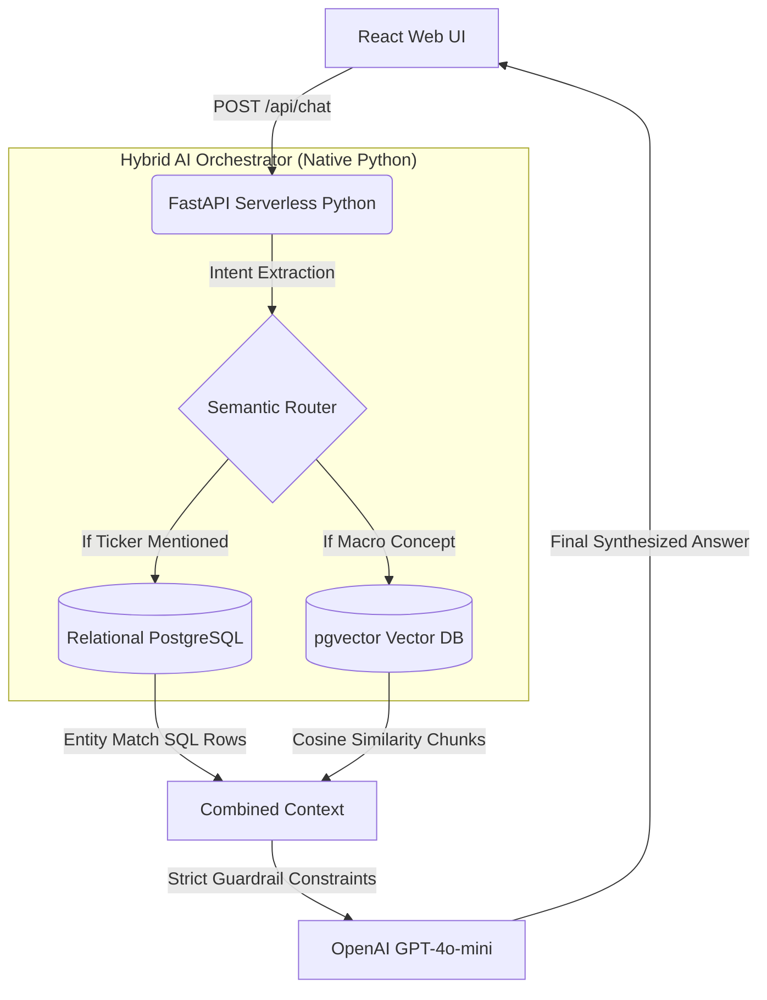

<div align="center">
  
  
  
  
  
</div>

# 📈 GenAI Capital: Stock Investment RAG Assistant
**Senior AI Engineer Technical Assessment**

A unified AI Orchestrator that natively interfaces with both **Unstructured Macroeconomic PDFs** and **Structured Equity Data (Excel/SQL)** to provide context-aware financial answers. 

This project was engineered specifically to demonstrate **production-grade architectural decisions**: decoupling the AI engine via a Python API, eliminating opaque LLM frameworks (No LangChain), and wrapping the experience in a premium serverless Next.js UI.

---

## 🏗️ Architecture & Component Design
To solve the dual-source requirement efficiently, the project adopts a **Hybrid RAG + Text-to-SQL Intent Router** pattern.



---

## ✅ Fulfillment of Assessment Requirements

| Core Requirement | Implementation Evidence |
|------------------|-------------------------|
| **1. Utilize Python** | The entire backend parsing, embedding, and LLM Orchestration logic is built in Native Python (`web/api/chat.py`). |
| **2. Relational Database** | `equities.xlsx` was loaded into a 3NF-compliant Supabase PostgreSQL instance. Tickers and Market Caps are safely queried using Entity Extraction, completely bypassing SQL Injection risks. |
| **3. Vector Database** | The OECD Economic Outlook PDF was chunked and mathematically embedded (OpenAI `text-embedding-3-small`) into Supabase `pgvector`, queried via Cosine Distance RPC calls. |
| **4. English Localization** | Prompts are injected with global overrides enforcing English output, regardless of user input language. |
| **5. NO LangChain / Wrappers** | Zero orchestration libraries were used. Semantic intent routing, document retrieval, and LLM system templating are executed programmatically via the raw OpenAI SDK. |
| **6. User Interface (Bonus)** | Elevated beyond a CLI script: Contains a Full-Stack **Next.js 14** Application deployed continuously via Vercel Edge Serverless Functions. |

---

## ⚙️ Model Configuration & Hyperparameters
To ensure financial auditing stability and eliminate creative hallucinations:
- **LLM Engine:** `gpt-4o-mini` (via OpenRouter)
- **Temperature:** `0.1` (Strict factual adherence)
- **Top-P:** `1.0`
- **Embedding Model:** `text-embedding-3-small` (1536-dimensional vectors)
- **Chunking Strategy:** 1000 tokens with 200 token overlap.

---

## 🛡️ Production & Security Considerations (Roadmap)
While this is a 48h MVP, it was uniquely structured on the Next.js+Supabase stack to allow immediate scale into production:
1. **Supabase Auth (JWT):** The architecture is prepared to inject JWT Bearer Tokens from the frontend to the Python API, enabling isolated, secure user chat histories.
2. **Row Level Security (RLS):** By migrating from Anon Keys to Authenticated Keys, Postgres RLS can govern which investor sees which equity data natively at the database layer.

---

## 🛠️ Local Setup Instructions

If you wish to run the app independently of the Vercel Deployment:

### 1. Requirements & Clone
Ensure you have `Python 3.12+` and `Node.js 18+`.
```bash
git clone https://github.com/negraodenio/talk2data.git
cd talk2data
```

### 2. Configure Environment `.env`
Create a `.env` file in the root (and `.env.local` inside `web/`):
```env
SUPABASE_URL="your_supabase_url"
SUPABASE_SERVICE_ROLE_KEY="your_supabase_service_role"
NEXT_PUBLIC_SUPABASE_URL="your_supabase_url"
NEXT_PUBLIC_SUPABASE_ANON_KEY="your_anon_key"
OPENROUTER_API_KEY="your_llm_key"
```

### 3. Start Backend (Python)
```bash
python -m venv venv
# Windows: .\venv\Scripts\activate | Mac/Linux: source venv/bin/activate
pip install -r web/requirements.txt
uvicorn web.api.chat:app --reload --port 8000
```

### 4. Start Frontend (React Next.js)
In a secondary terminal:
```bash
cd web
npm install
npm run dev
```

Navigate to `http://localhost:3000`.

---

## 💡 Example Queries to Test

1. **[Vector Search]** *"What does the OECD report mention about global growth resilience?"*
2. **[Relational SQL]** *"What is the target price and current status of Microsoft?"*
3. **[Hybrid RAG]** *"What is the Target Price of Tesla and how does global inflation impact growth according to the OECD?"*
4. **[Guardrail Fallback]** *"What is the target price of FakeCompany Ltd?"* (Will trigger the "Data Not Available" security override).
