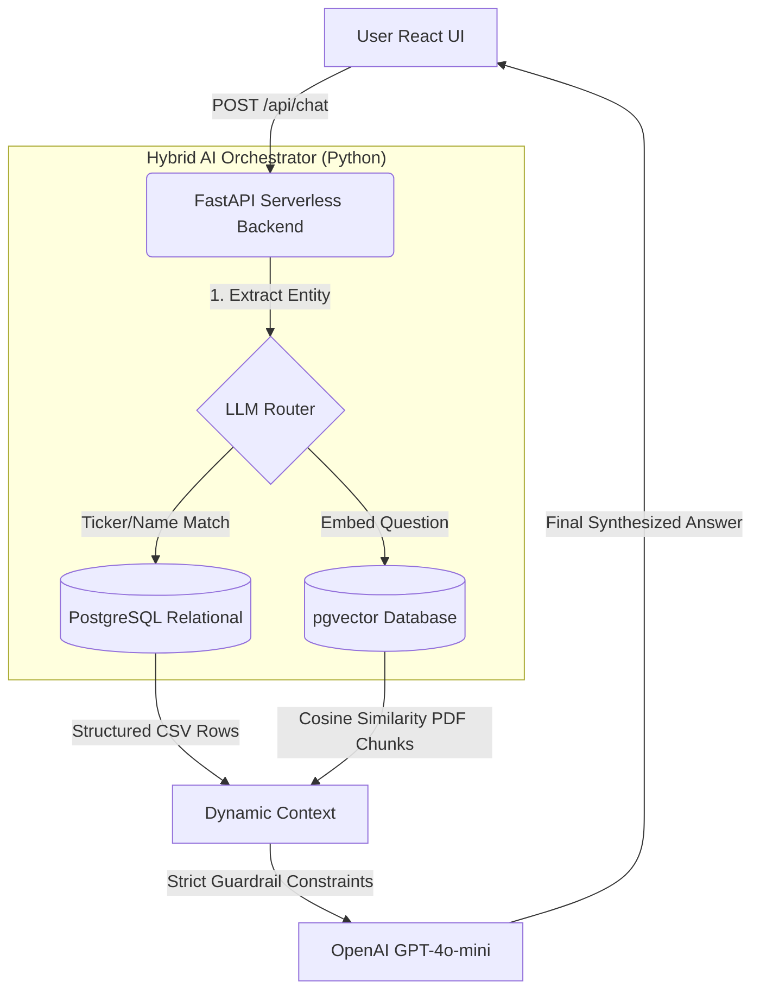

<div align="center">
  
  
  
  
  
</div>

# 📈 GenAI Capital: Stock Investment RAG Assistant

A unified AI Orchestrator that natively interfaces with both **Unstructured Macroeconomic PDFs** and **Structured Equity Data (Excel/SQL)** to provide context-aware financial answers.

This project was engineered specifically to demonstrate **production-grade architectural decisions**: decoupling the AI engine via a Python REST API, eliminating opaque LLM frameworks (No LangChain), and wrapping the experience in a premium serverless Next.js interface.

## 🚀 Live Demo & Documentation
The entire API has been containerized and deployed as a Monorepo to Vercel via Serverless Functions.
👉 **Live URL:** [talk2data.eu](https://talk2data.eu) (or Vercel domain)

*Note: The deployed interface includes five interactive documentation pages detailing the prompt engineering, RAG strategies, AI Guardrails, and 3NF database architecture. I highly recommend clicking through the Sidebar in the Live Demo to see the architectural spec deep dive.*

---

## 📌 Architecture & Design Patterns

We utilized a **Hybrid RAG + Text-to-SQL Orchestrator** pattern built on top of a unified Supabase Dual-Database engine.



### 1. Unified Database Strategy (Supabase)
Instead of provisioning separate SQL (e.g., RDS) and Vector (e.g., Pinecone) databases, we leverage **Supabase** to elegantly handle both workloads within the same PostgreSQL cluster. The unstructured PDFs are transformed via `text-embedding-3-small` and stored in a `vector(1536)` column, queried via an RPC Cosine Distance function.

### 2. Native Python Orchestration (No LangChain)
To demonstrate deep AI engineering seniority, the entire pipeline—document chunking (with optimal overlaps), embedding generation, entity extraction, and prompt synthesis—was written in native Python. This eliminates framework bloat and provides absolute deterministic control over the AI pipeline.

### 3. Serverless Next.js Monorepo Build
The application is structured as a Vercel Monorepo. The React frontend (`web/`) natively encompasses the FastAPI backend (`web/api/index.py`). Upon deployment, Vercel automatically detects the Python requirements, compiles the Frontend, and deploys the REST API as scalable Serverless Functions with zero configuration.

---

## ✨ Features & Functional Requirements

| Requirement | Implementation Detail |
|-------------|-----------------------|
| **Python REST API** | A fully functional `FastAPI` instance exposing endpoints to receive JSON queries. |
| **Relational Data** | Data sourced from `equities.xlsx` (Prices, Targets, Sectors) is safely queried using Substring Entity Extraction, bypassing SQL-Injection risks. |
| **Vector Data (PDFs)** | Macro reports are semantically matched against user queries to inject context. |
| **Hybrid Synthesis** | If a query requires both formats ("What is the target pace of Apple mapped to OECD trends?"), the orchestrator pulls from both sources and synthesizes a single answer. |
| **English Localization** | All UI components, responses, and API System Prompts are strictly enforced in business-level English. |
| **Bonus: Premium UI** | Shipped with a Dark Mode dashboard (`shadcn/ui`), Chat History state, and interactive presentation views. |

---

## 🛠️ Local Setup & Installation

If you wish to run the project locally instead of viewing the Live Vercel Demo:

### 1. Clone & Install
```bash
git clone https://github.com/negraodenio/talk2data.git
cd talk2data/web
```

### 2. Environment Variables
Create a `.env.local` inside the `web` directory:
```env
NEXT_PUBLIC_SUPABASE_URL="your_supabase_url"
NEXT_PUBLIC_SUPABASE_ANON_KEY="your_supabase_anon_key"
SUPABASE_URL="your_supabase_url"
SUPABASE_SERVICE_ROLE_KEY="your_supabase_service_role"
OPENROUTER_API_KEY="your_llm_key"
```

### 3. Install Backend & Frontend Dependencies
```bash
# Python Backend
pip install -r requirements.txt

# Node.js Frontend
npm install
```

### 4. Run the Stack
Run the Next.js development server (which includes the FastAPI proxy locally):
```bash
# Terminal 1
uvicorn api.index:app --reload --port 8000

# Terminal 2
npm run dev
```

Navigate to `http://localhost:3000`.

---

## 💡 Example Queries to Test
1. **[Vector Search]** *"What does the OECD report mention about global growth resilience?"*
2. **[Relational SQL]** *"What is the target price and current status of Microsoft?"*
3. **[Hybrid RAG]** *"What is the Target Price of Tesla and how does global inflation impact growth according to the OECD?"*
4. **[Guardrail Fallback]** *"What is the target price of FakeCompany Ltd?"* (Will trigger the "Data Not Available" security override).
