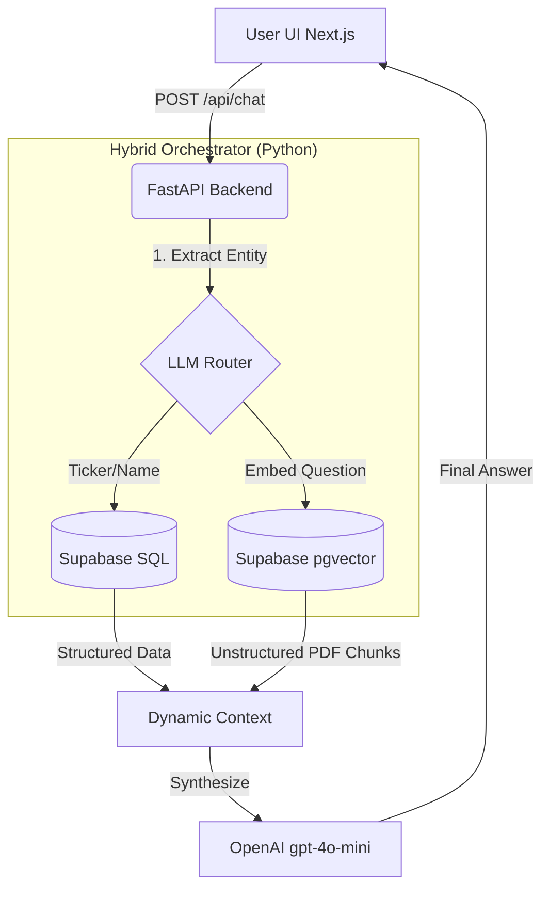

# GenAI Capital: Stock Investment Research Assistant

A GenAI-powered research assistant designed to synthesize macroeconomic insights from unstructured PDF reports with exact equity metrics from structured CSV data. This tool features a modern Next.js frontend and a serverless-ready FastAPI backend, entirely orchestrating large language models without reliance on high-level frameworks like LangChain or LangGraph.

## 📌 Architecture & Data Flow

This project adopts a **Hybrid RAG + Text-to-SQL** retrieval pattern built on Supabase.



## 📖 Product Requirements Document (PRD)

**1. Vision & Problem**
Financial analysts spend hours alternating between specialized data terminals (like Bloomberg) to find stock metrics and reading lengthy macroeconomic PDF reports to form an investment thesis. There is no unified conversational interface that allows cross-pollinated queries (e.g., "What is the target price of Apple and how do global inflation trends impact it?").

**2. Target Audience**
Portfolio Managers, Quantitative Analysts, and Retail Investors looking for synthesized dual-source research.

**3. Core Features**
- **Structured Data Querying**: Users can ask for specific stock metrics (Prices, Target Prices, P/E Ratios) securely extracted from internal datasets.
- **Unstructured Macro Insights**: Semantic search across hundreds of pages of global economic outlook reports.
- **Hybrid Synthesis**: A sophisticated engine that detects queries requiring both data sources and merges them transparently.

## ⚙️ Technical Specification (Spec-Driven)

### Stack Chosen
- **Frontend**: Next.js 14, Tailwind CSS, shadcn/ui.
- **Backend API**: Python 3.10+, FastAPI.
- **Database (Relational + Vector)**: Supabase PostgreSQL (utilizing the `pgvector` extension).
- **LLM/Embeddings**: OpenAI (via OpenRouter) `gpt-4o-mini` and `text-embedding-3-small`.

### Fulfilling Core Requirements
1. **No LangChain/LangGraph**: Orchestration, retries, embedding generation, and LLM prompting are written natively in clean Python leveraging the standard OpenAI SDK. This ensures absolute control over the data pipeline.
2. **Text-to-SQL Capabilities**: Instead of executing arbitrary generated SQL statements (which poses severe security vulnerabilities like SQL injection), the Orchestrator uses an LLM to extract financial entities and safely executes structural programmatic queries via the Supabase Client. This achieves the *capabilities* of Text-to-SQL safely in an MVP environment.
3. **Unified Database**: By choosing Supabase, the architectural complexity is drastically reduced. Supabase acts as both the relational database (for equities data) and the vector store (for PDF RAG).

## 🚀 Setup & Installation

### 1. Prerequisites
- Python 3.10+
- Node.js 18+
- A Supabase Project (with `URL` and `SERVICE_ROLE_KEY`)
- An OpenRouter / OpenAI API Key

### 2. Database Preparation
Run the `schema.sql` script in the Supabase SQL Editor. This will create the `equities` table, the `documents` table, and the `match_documents` RPC function.

### 3. Environment Variables
Create a `.env` file in the root directory:
```env
SUPABASE_URL="your_url"
SUPABASE_SERVICE_ROLE_KEY="your_secret_key"
OPENROUTER_API_KEY="your_llm_key"
```

### 4. Data Ingestion
Place your `equities.xlsx` and `PDF` folders in the root directory and run the ingestion pipeline.
```bash
python -m venv venv
source venv/bin/activate  # or .\venv\Scripts\activate on Windows
pip install -r requirements.txt
python ingest.py
```

### 5. Running the Application
The app utilizes Vercel's convention of routing a Next.js static site to a Python `/api` backend.

**Terminal 1 (Backend):**
```bash
uvicorn api.index:app --reload
```

**Terminal 2 (Frontend UI):**
```bash
cd web
npm install
npm run dev
```
Navigate to `http://localhost:3000`.

## 📌 Example Queries
- **Macro**: *What are the OECD projections for global GDP growth in 2025?*
- **Structured**: *What is the target price and current market cap of Microsoft?*
- **Hybrid**: *What is the target price of Apple and what does OECD say about the geopolitical risks to the global market?*

## 💡 Assumptions & Limitations
- **Data Completeness**: Due to MVP scope, the ingest pipeline assumes Excel data structure consistency.
- **Cost**: Embedding multiple large PDFs takes time and consumes LLM API credits.
- **Security**: The current Text-to-SQL implementation extracts entities rather than generating raw SQL to bypass standard SQL Injection risks. In a full production environment, an enterprise Text-to-SQL system would require rigorous AST (Abstract Syntax Tree) sanitization.
